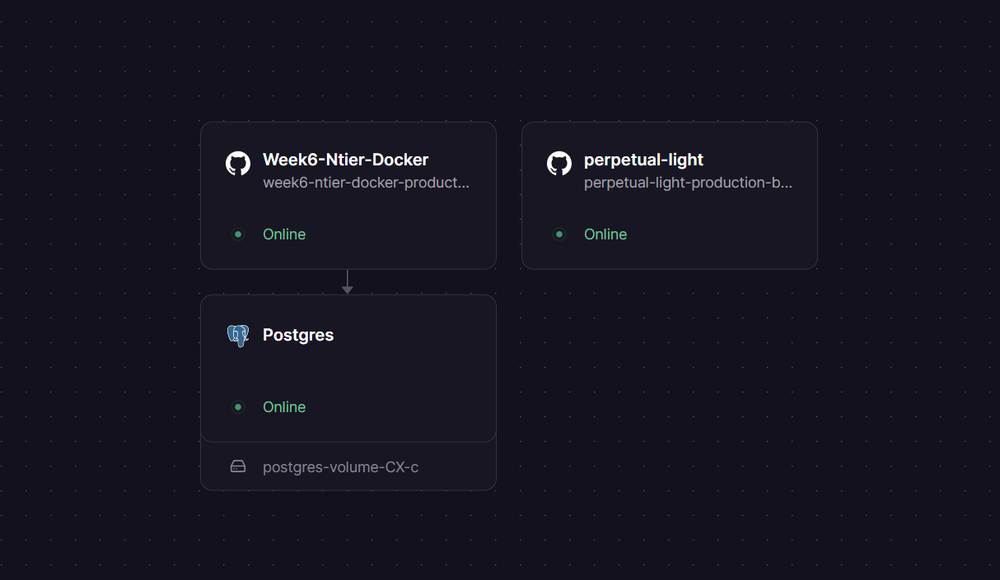
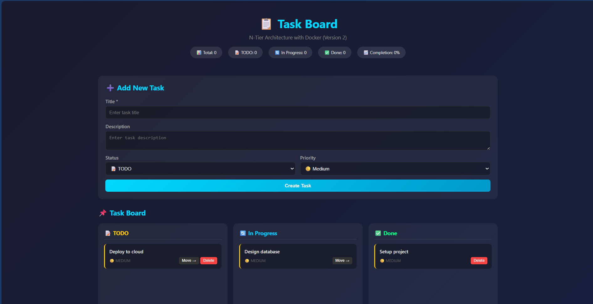
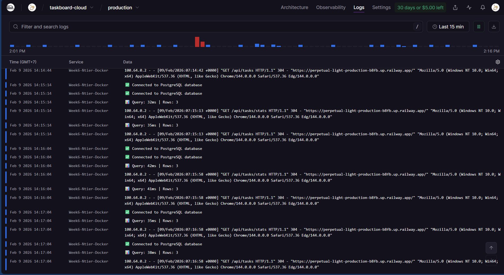
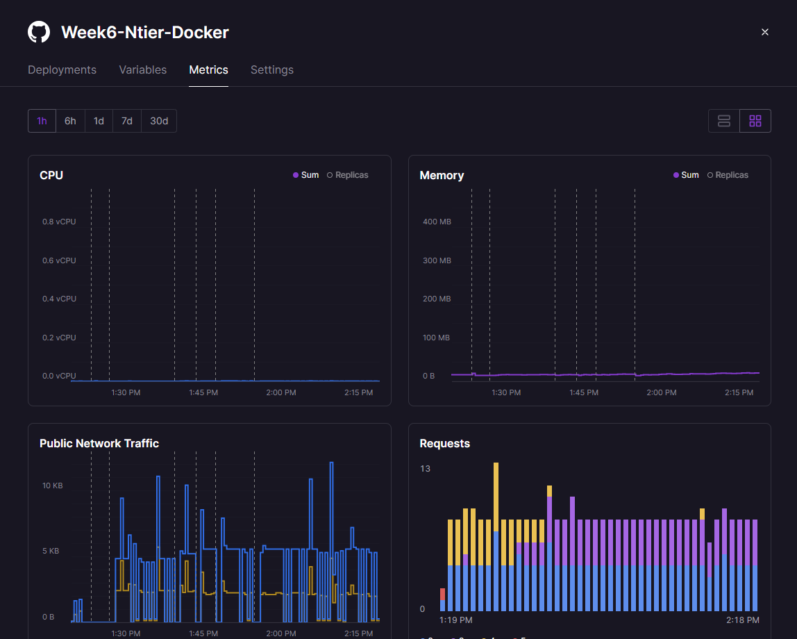

# Cloud Deployment Analysis
## ENGSE207 - Week 7 Lab

**ชื่อ-นามสกุล:** ณัฐสิทธิ์ มะโนชัย  
**รหัสนักศึกษา:** 67543210056-7

---

## 1.1 URLs ของระบบที่ Deploy

| Service | URL |
|---------|-----|
| Frontend | https://perpetual-light-production-b8fb.up.railway.app |
| Backend API | https://week6-ntier-docker-production-2a78.up.railway.app/api |
| Database | (Internal - Railway PostgreSQL) |

---

## 1.2 Screenshot หลักฐาน (5 รูป)

### 1. Railway Dashboard แสดง 3 Services

---

### 2. Frontend ทำงานบน Browser

---

### 3. API Health Check Response

---

### 4. Logs แสดง Requests

---

### 5. Metrics แสดง CPU / Memory

---

# ส่วนที่ 2: เปรียบเทียบ Docker vs Cloud

## 2.1 ความแตกต่างที่สังเกตเห็น

| ด้าน | Docker (Week 6) | Railway (Week 7) |
|------|-----------------|------------------|
| เวลา Deploy | ต้อง build image เอง ใช้เวลานาน | Auto deploy จาก GitHub เร็วกว่า |
| การตั้งค่า Network | ต้องตั้ง docker network เอง | Railway จัดการให้อัตโนมัติ |
| การจัดการ ENV | ใช้ .env file | ใช้ Variables tab |
| การดู Logs | docker logs | ดูผ่านหน้า Logs UI |
| การ Scale | ต้อง config เอง | กดเพิ่ม instance ได้ |

---

## 2.2 ข้อดี/ข้อเสีย

### Docker Local
**ข้อดี:**
- ควบคุม environment ได้ 100%
- ทำงาน offline ได้
- Debug ง่าย

**ข้อเสีย:**
- Deploy สู่ production ยาก
- ต้อง config network/database เอง

---

### Railway Cloud
**ข้อดี:**
- Deploy เร็วมาก
- มี URL ใช้ทันที
- มี Metrics / Logs ให้ดู

**ข้อเสีย:**
- ควบคุม server ได้น้อย
- มีค่าใช้จ่ายถ้าใช้เกินฟรี

---

# ส่วนที่ 3: Cloud Service Models

## 3.1 Railway เป็น Service Model แบบไหน?

[x] PaaS

**เพราะ:**  
Railway จัดการ Infrastructure, OS, Network, Runtime ให้ทั้งหมด  
ผู้ใช้เพียงแค่ Deploy code และตั้งค่า environment variables

---

## 3.2 ถ้าใช้ IaaS (เช่น AWS EC2) ต้องทำอะไรเพิ่ม

1. ติดตั้ง OS และ Runtime (Node.js, Docker)  
2. ตั้งค่า Network / Firewall  
3. ติดตั้ง Database เอง  
4. Configure Load balancer / Scaling  

---

# ส่วนที่ 4: 12-Factor App Analysis

## 4.1 Factors ที่เห็นจาก Lab

| Factor | เห็นจากไหน? | ทำไมสำคัญ? |
|--------|-------------|------------|
| Factor 3: Config | Variables tab | แยก config ออกจาก code |
| Factor 2: Dependencies | package.json | จัดการ library ชัดเจน |
| Factor 5: Build/Release/Run | Deploy pipeline | แยกขั้นตอน deploy |
| Factor 6: Processes | Railway container | Run เป็น stateless process |
| Factor 7: Port Binding | ใช้ process.env.PORT | รองรับ cloud runtime |

---

## 4.2 ถ้าไม่ทำตาม 12-Factor จะเกิดอะไร

**ปัญหา 1:** ถ้าไม่ทำตาม Factor 3 (Config)  
- สิ่งที่จะเกิด: Hardcode DB URL → เปลี่ยน environment ไม่ได้

**ปัญหา 2:** ถ้าไม่ทำตาม Factor 6 (Processes)  
- สิ่งที่จะเกิด: App scale ไม่ได้ / crash ง่าย

---

# ส่วนที่ 5: Reflection

## 5.1 สิ่งที่เรียนรู้จาก Lab นี้

1. การ deploy ระบบขึ้น Cloud จริง  
2. การเชื่อมต่อ Frontend + Backend + Database  
3. การใช้ Environment Variables บน PaaS  

---

## 5.2 ความท้าทาย/ปัญหา และวิธีแก้

**ปัญหา:**  
Deploy แล้ว service crashed เพราะ config และ database schema ไม่ตรง

**วิธีแก้:**  
ตรวจ Logs, แก้ server.js, เพิ่ม column ใน database จน API ทำงานได้

---

## 5.3 จะเลือกใช้ Docker หรือ Cloud เมื่อไหร่

**ใช้ Docker เมื่อ:**
- พัฒนา local
- ทำ lab / testing
- ต้องควบคุม environment

**ใช้ Cloud (PaaS) เมื่อ:**
- ต้องการ deploy production
- แชร์ระบบผ่าน URL
- ต้องการ auto scaling

---
